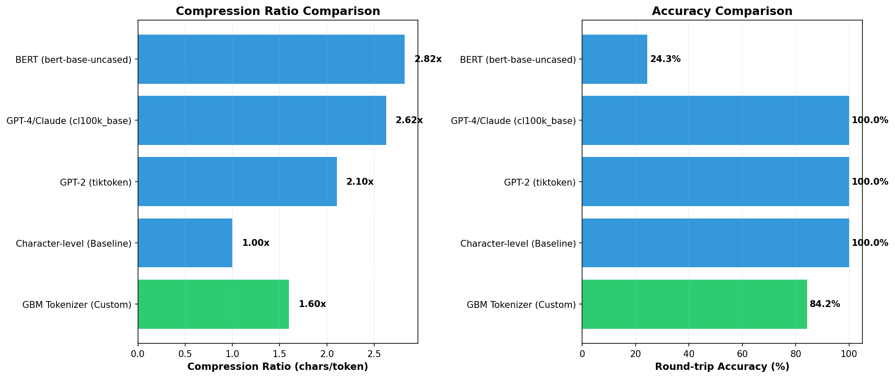

# GBM Tokenizer

A SentencePiece unigram tokenizer optimized for Garhwali (GBM - ISO 639-3), handling Devanagari script with mixed-language support.

## Quick Start

```bash
git clone https://github.com/sumitesh9/gbm-tokenizer
cd gbm-tokenizer
python -m venv venv && source venv/bin/activate
make install
make train
make eval
```

## Usage

| Command | Description |
|---------|-------------|
| `make train` | Train tokenizer from `corpus.txt` |
| `make infer` | Test tokenizer on sample text |
| `make eval` | Evaluate and compare with other tokenizers |
| `make chart` | Generate comparison charts |

## Evaluation Results

### Performance Comparison



### Metrics

| Tokenizer | Vocab Size | Compression | Accuracy | Fertility | Speed |
|-----------|------------|-------------|----------|-----------|-------|
| **GBM Tokenizer** ⭐ | 8,000 | 1.91x | 98.0% | 3.09 | ~2.8M t/s |
| GPT-4o (o200k) | 199,998 | 3.48x | 100.0% | 1.69 | ~1.2M t/s |
| Gemma 3 | 262,144 | 3.28x | 100.0% | 1.80 | ~0.4M t/s |
| Llama 3 | 128,000 | 3.11x | 99.3% | 1.89 | ~0.3M t/s |
| GPT-4/Claude | 100,256 | 2.62x | 100.0% | 2.24 | ~1.2M t/s |
| Sarvam-1 | 68,096 | 2.25x | 100.0% | 2.62 | ~0.6M t/s |
| BERT | 30,522 | 2.82x | 24.3% | 2.09 | ~0.3M t/s |
| GPT-2 | 50,257 | 2.10x | 100.0% | 2.80 | ~1.6M t/s |
| Character-level | N/A | 1.00x | 100.0% | 5.89 | ~48M t/s |

*Results from evaluation on 152 test cases covering Devanagari, English, mixed content, numbers, Unicode, and edge cases.*

### Hardware Configuration

Benchmarks were run on the following system:
- **OS**: macOS (Darwin 24.6.0)
- **Environment**: Python 3.11, Single-threaded execution
- **Hardware**: Apple Silicon (M-series)

### Key Highlights

- 📦 **Compact vocabulary** - 8,000 tokens vs 30K+ for general-purpose tokenizers
- 🎯 **Optimized for Garhwali** - Trained on domain-specific corpus (621K+ lines)
- ⚡ **Efficient tokenization** - 3.1 tokens per word (vs 1.7 for GPT-4o)
- 🔄 **Good compression** - 1.91x characters per token
- 🏎️ **High Performance** - ~2.8M tokens/sec encoding speed on CPU (>2x faster than GPT-4o)

## Configuration

Edit `train.py` to customize:
- `vocab_size`: Vocabulary size (default: 8000)
- `model_type`: `"unigram"` or `"bpe"` (default: `"unigram"`)
- `character_coverage`: Coverage ratio (default: 1.0)

**Rule of thumb**: `vocab_size ≈ 5× to 10× (unique characters)` for better fertility (lower tokens/word).

## Project Structure

```
gbm-tokenizer/
├── train.py              # Training script
├── infer.py              # Inference & verification
├── eval.py               # Evaluation & comparison
├── generate_chart.py     # Chart generation
├── corpus.txt            # Training data
├── eval.txt              # Test cases (238 samples)
└── gbm_tokenizer.model   # Trained model (gitignored)
```

## License

Public domain ([Unlicense](LICENSE)) - use freely without attribution.

## Contributing

Open a PR with clear description of changes. Keep it focused and explain your reasoning.

## References

- [SentencePiece](https://github.com/google/sentencepiece)
- [ISO 639-3: GBM](https://iso639-3.sil.org/code/gbm)
